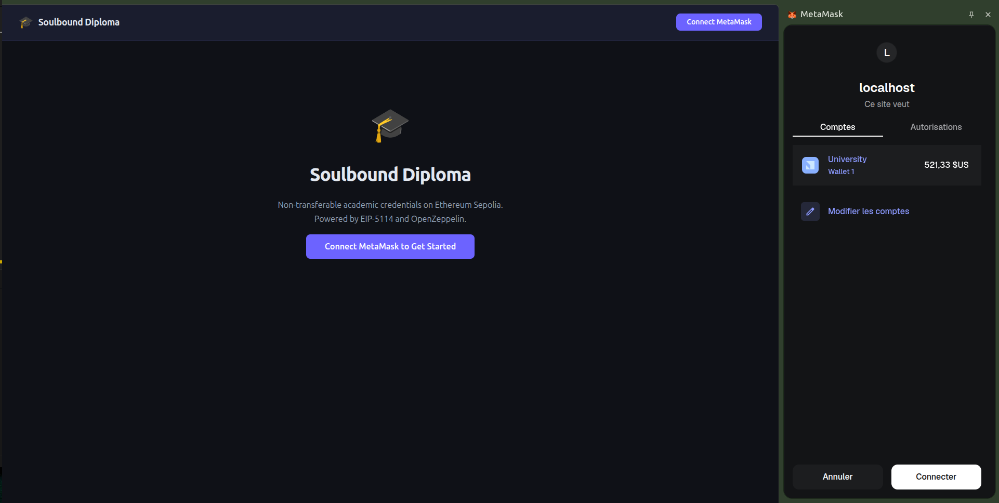
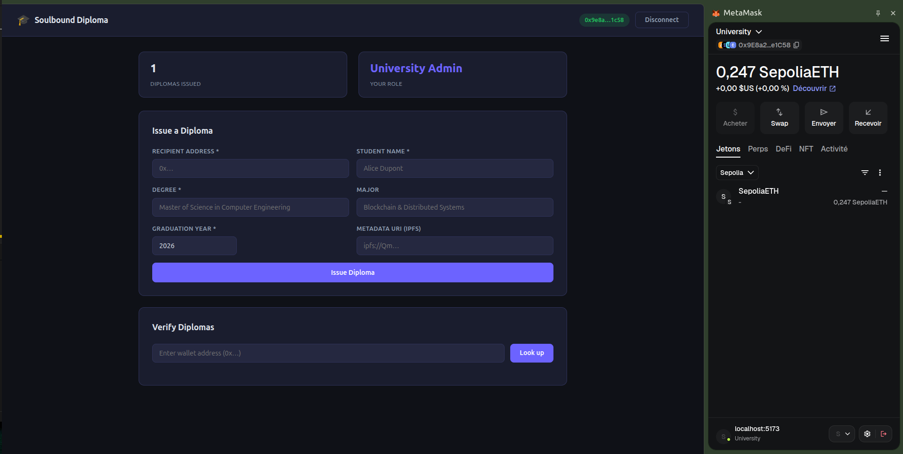
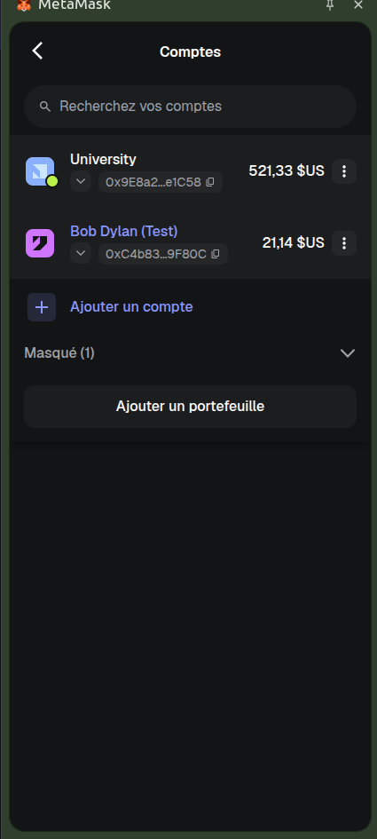
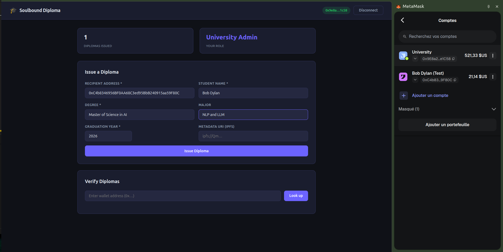
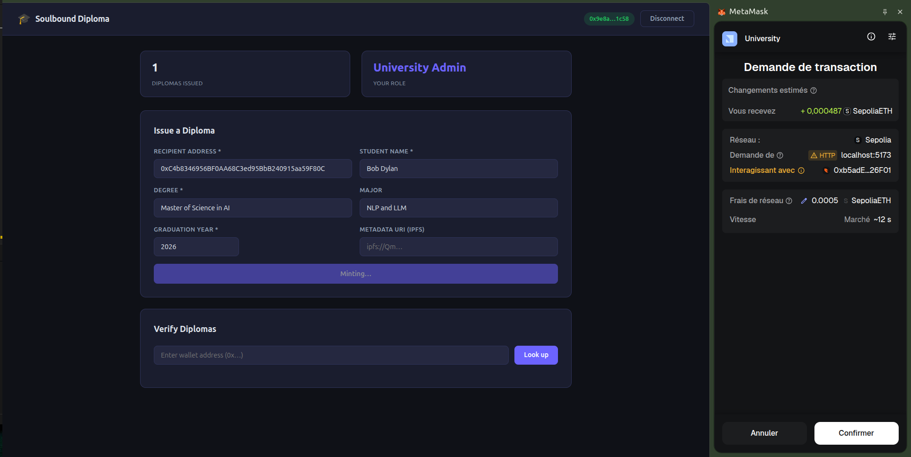
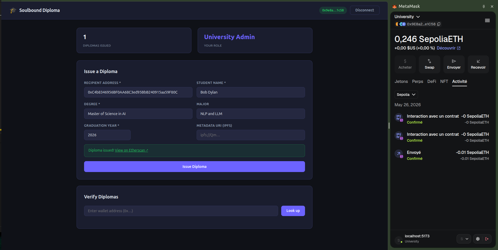
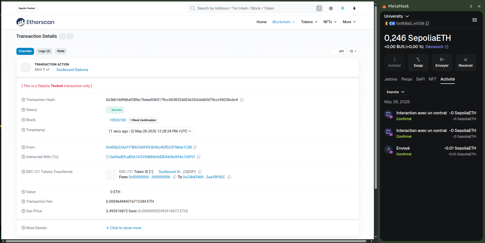
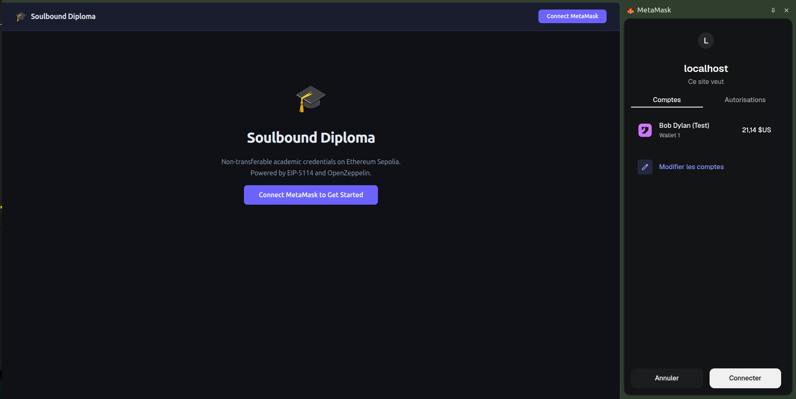
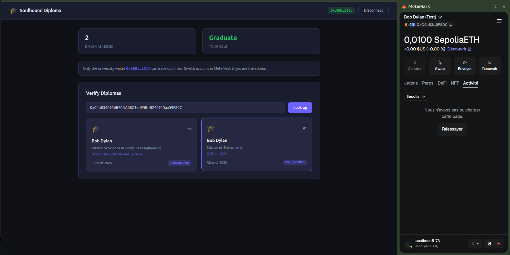

# Soulbound Diploma — EIP-5114

> NFT non transférable représentant un diplôme académique sur Ethereum Sepolia.  
> Mini-projet Blockchain — IT University Madagascar 2025/2026

## Présentation

Un **Soulbound Token (SBT)** est un NFT **non transférable**, lié de façon permanente à un wallet.

Ce projet implémente un registre de diplômes où :

- L'**université** (owner du contrat) émet les diplômes vers les wallets des diplômés.
- Les diplômes sont **soulbound** : `transferFrom`, `approve` et `setApprovalForAll` échouent toujours.
- Tout le monde peut **vérifier** les diplômes d'une adresse.

| Livrable | Lien |
|----------|------|
| **Contrat Sepolia** | [`0xb5adEfcaB5A163336B86b5dDE4436a934a126F01`](https://sepolia.etherscan.io/address/0xb5adEfcaB5A163336B86b5dDE4436a934a126F01#code) |
| **Démo vidéo** | _À compléter (Loom / YouTube non listé)_ |
| **Repo GitHub** | https://github.com/MirijaMarc/blockchain-m2-diplome-soulbound |

---

## Stack technique

| Couche | Technologie |
|--------|-------------|
| Smart contract | Solidity 0.8.28, OpenZeppelin 5, pattern EIP-5114 |
| Outils | Hardhat 2, ethers.js v6 |
| Frontend | Vue 3 + Vite, ethers.js v6 |
| Réseau | Ethereum Sepolia (testnet) |

---

## Structure du projet

```
blockchain-m2-diplome-soulbound/
├── contracts/SoulboundDiploma.sol
├── test/SoulboundDiploma.test.js
├── scripts/deploy.js
├── front/                    # DApp Vue 3
├── screenshots/              # Captures pour le rendu
├── hardhat.config.js
├── .env.example
└── package.json
```

---

## Étapes — Installation et configuration

### Prérequis

- Node.js v18+
- Extension MetaMask
- ETH Sepolia ([faucet](https://sepoliafaucet.com))

### 1. Cloner et installer les dépendances

```bash
git clone https://github.com/MirijaMarc/blockchain-m2-diplome-soulbound.git
cd blockchain-m2-diplome-soulbound

npm install
cd front && npm install && cd ..
```

### 2. Configurer l'environnement

```bash
cp .env.example .env
```

Remplir `.env` :

| Variable | Description |
|----------|-------------|
| `PRIVATE_KEY` | Clé privée du wallet déployeur (jamais commitée) |
| `SEPOLIA_RPC_URL` | URL RPC Sepolia (Alchemy, Infura, …) |
| `ETHERSCAN_API_KEY` | Clé API Etherscan (vérification du contrat) |
| `VITE_CONTRACT_ADDRESS` | Adresse du contrat déployé (voir ci-dessous) |

### 3. Compiler le contrat et synchroniser l'ABI

```bash
npm run compile
```

Copie automatiquement l'ABI vers `front/src/abi/SoulboundDiploma.json`.

### 4. Lancer les tests unitaires

```bash
npm run test:contract
```

13 tests : déploiement, émission, lecture, restrictions soulbound.

---

## Étapes — Déploiement sur Sepolia

> **Déjà déployé** pour ce projet. Pour redéployer :

```bash
npm run deploy:sepolia
```

Copier l'adresse affichée dans `.env` :

```env
VITE_CONTRACT_ADDRESS=0xb5adEfcaB5A163336B86b5dDE4436a934a126F01
```

Vérifier sur Etherscan (bonus) :

```bash
npx hardhat verify --network sepolia 0xb5adEfcaB5A163336B86b5dDE4436a934a126F01
```

---

## Étapes — Lancer la DApp

```bash
npm run front:dev
```

Ouvrir **http://localhost:5173/**

MetaMask doit être sur le réseau **Sepolia**.

---

## Étapes — Utilisation de la DApp

### Rôles

| Wallet | Rôle affiché | Actions |
|--------|--------------|---------|
| Owner du contrat (`0x9E8a…1C58`) | **University Admin** | Émettre des diplômes |
| Autre adresse (ex. diplômé) | **Graduate** | Vérifier ses diplômes |

### A. Émettre un diplôme (compte université)

1. Connecter MetaMask avec le wallet **owner** (celui qui a déployé le contrat).
2. Vérifier le rôle **University Admin**.
3. Remplir le formulaire **Issue a Diploma** :
   - **Recipient Address** : adresse du diplômé
   - **Student Name**, **Degree**, **Major**, **Graduation Year**
   - **Metadata URI** (optionnel, ex. `ipfs://Qm…`)
4. Cliquer **Issue Diploma** et confirmer dans MetaMask.
5. Attendre la confirmation → lien Etherscan affiché.

### B. Créer un 2ᵉ compte test (MetaMask)

1. MetaMask → **Comptes** → **Ajouter un compte**.
2. Copier la nouvelle adresse → l'utiliser comme **Recipient** à l'étape A.
3. (Optionnel) Envoyer un peu de Sepolia ETH depuis le compte admin pour les frais futurs.

### C. Vérifier un diplôme (compte diplômé)

1. Changer de compte dans MetaMask (adresse du diplômé).
2. Rafraîchir la page → rôle **Graduate**.
3. Section **Verify Diplomas** : coller l'adresse du diplômé → **Look up**.
4. La carte du diplôme s'affiche avec le badge **Soulbound**.

### D. Vérifier sur Etherscan

- [Contrat vérifié](https://sepolia.etherscan.io/address/0xb5adEfcaB5A163336B86b5dDE4436a934a126F01#code)
- Onglet **Transactions** → appel `issueDiploma`
- Onglet **Read Contract** → `getDiploma`, `diplomasOf`, `totalIssued`

---

## Fonctions du contrat

| Fonction | Accès | Description |
|----------|-------|-------------|
| `issueDiploma(...)` | Owner only | Mint un diplôme soulbound |
| `getDiploma(tokenId)` | Public | Lire les métadonnées |
| `diplomasOf(address)` | Public | Liste des token IDs d'un détenteur |
| `totalIssued()` | Public | Nombre total de diplômes émis |
| `transferFrom` / `approve` / … | Désactivé | Revert — soulbound |

---

## Captures d'écran

| # | Description |
|---|-------------|
| 1 | Connexion MetaMask — compte université |
| 2 | Dashboard University Admin |
| 3 | Comptes MetaMask (admin + étudiant) |
| 4 | Formulaire Issue a Diploma |
| 5 | Demande de transaction MetaMask |
| 6 | Transaction confirmée |
| 7 | Contrat sur Etherscan |
| 8 | Connexion compte étudiant |
| 9 | Vérification du diplôme (Bob Dylan, #0) |











---

## Scripts npm

| Commande | Action |
|----------|--------|
| `npm run compile` | Compile + sync ABI |
| `npm run test:contract` | Tests Hardhat |
| `npm run deploy:sepolia` | Déploie sur Sepolia |
| `npm run front:dev` | Lance la DApp (dev) |
| `npm run front:build` | Build production (`front/dist/`) |

---

## Bonus réalisés

- Tests unitaires Hardhat (13 tests)
- OpenZeppelin (`ERC721`, `Ownable`)
- NatSpec dans le contrat
- Contrat vérifié sur Etherscan

---

## Licence

MIT
